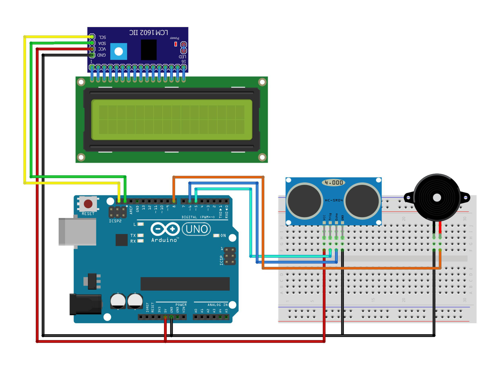

# Controller Animal Feed Automatic

This project implements an automatic animal feed level controller using an Arduino. The system measures the feed level in a container using an ultrasonic sensor (HCSR04) and displays the percentage on an LCD. If the feed level drops below 15%, a buzzer alarm is triggered to notify the user to refill the feed.

## Components Used

- **Arduino IDE**
- **Library: LiquidCrystal_I2C**
- **Library: HC-SR04**
- **Arduino Uno** (or compatible board) - 1 Unit
- **HCSR04 Ultrasonic Sensor** - 1 Unit
- **LiquidCrystal_I2C (LCD)** (16x2) - 1 Unit
- **I2C Module** - 1 Unit
- **Buzzer** - 1 Unit
- **Project Board / BreadBoard** - 1 Unit
- **Jumper Wires**
- **Power Supply** (for Arduino and other components)

## Circuit Schematic

Below you can see a schematic image to facilitate the wiring of cables from the microcontroller to devices, both input and output sensors:

## Circuit Diagram

### Wiring Instructions

- **HCSR04 Ultrasonic Sensor:**
  - **Trig Pin** to Digital Pin 5 (D5) on the Arduino
  - **Echo Pin** to Digital Pin 6 (D6) on the Arduino
  - **VCC** to 5V
  - **GND** to GND
- **Buzzer:**
  - **Positive Pin** to Digital Pin 8 (D8) on the Arduino
  - **Negative Pin** to GND
- **LiquidCrystal_I2C (16x2) + Include I2C:**
  - **SDA I2C** to pin A4 on SDA pin of the Arduino
  - **SCL I2C** to pin A5 on SCL pin of the Arduino
  - **VCC I2C** to 5V
  - **GND I2C** to GND

## How It Works

- The HCSR04 ultrasonic sensor measures the height of the feed in the container.
- The measured feed level is converted into a percentage and displayed on the LCD screen.
- If the feed level drops below 15%, the buzzer sounds an alarm, and a message prompting to refill the feed is displayed on the LCD.

## Code Explanation

- **Sensor Initialization:** The HCSR04 ultrasonic sensor is initialized on pins D5 (Trig) and D6 (Echo).
- **LCD Initialization:** The LiquidCrystal_I2C library is used to interface with a 16x2 LCD display.
- **Buzzer Alarm:** If the feed level is below 15%, the buzzer is triggered, and a refill message is displayed.

## Installation

1. Gather all components listed above.
2. Connect the components following the wiring instructions.
3. Open the Arduino IDE and connect your Arduino board.
4. Copy the provided code into the Arduino IDE.
5. Upload the code to your Arduino Uno.

## Usage

- Once installed, the system will continuously monitor the feed level.
- If the feed level is sufficient, the percentage is displayed on the LCD.
- If the feed level drops below 15%, the buzzer will sound, and the LCD will display a prompt to refill the feed.

## Conclusion

- The Controller Animal Feed Automatic provides an effective way to manage the feed levels in animal feeders. The system ensures that you are notified when the feed level is low, preventing your animals from running out of food.

- When the feed height is <15% then an alarm will sound and The LCD screen will display the text “ISI PAKAN…!!!”
